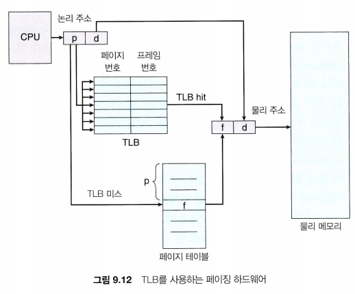

## main memory
### static linking VS. dynamic linking
- static linking: 정적 링킹. 컴파일 링킹 때 라이브러리를 그대로 복사해서 실행 파일에 이진 형식으로 넣음.

	-> 메모리를 많이 잡아먹음.

 - dynamic linking: 동적 링킹. 프로그램이 실행될 때, 라이브러리가 필요하다면 라이브러리를 가져와서 링킹. 한 번 링킹이 되어 있다면 가져왔던 라이브러리를 그대로 사용.

	-> 메모리 요구사항이 적음. jump를 하기 때문에 overhead 발생.

	-> 라이브러리의 버전업이 되었을 때 편리. 그대로 가져와서 사용하면 됨.

### 주소 할당
1. 컴파일 시간(compile time)
절대 코드 생성. 위치 변경이 필요하면 다시 컴파일해야 함.

2. 적재 시간(load time)
프로세스를 메모리에 로딩 시 통째로 적재.

3. 실행 시간(execution time)
프로세스 실행 중 코드가 실행될 때마다 코드를 로딩.

### 연속 메모리 할당 - external fragmentation 발생, 50% rule
1. first-fit
2. best-fit
3. worst-fit

### 페이징(고정 분할) - internal fragmentation 발생

- **프레임 테이블:**
 각 프레임의 할당 여부와 할당 페이지의 위치를 나타냄.

- **PTBR(페이지 테이블 기준 레지스터):**
페이지 테이블이 커지면 레지스터에 적재할 수 없으므로, 메모리에 페이지 테이블을 적재한 후 그 페이지 테이블을 가리키는 레지스터(PTBR)을 사용.
	-> PTBR은 레지스터에 페이지 테이블을 적재하는 것보다 context switiching이 빠르지만, 메모리에 2번 접근해야 하므로 메모리 액세스 타임이 느려질 수 있음.
- **TLB(translation look-aside buffers):**
	페이지 테이블의 일부분을 저장하는 하드웨어 캐시. 캐시에 저장해놓고 페이지를 바로 찾으므로 메모리 액세스 성능 저하가 거의 없음. 

	-> TLB에 찾으려는 페이지가 없을 경우(TLB 미스), 메모리 내 페이지 테이블에 액세스하여 페이지를 찾아옴. 

	-> TLB가 가득 차면, 교체 정책 사용. 중요 커널 코드는 TLB에 고정될 수 있음.
	
	-> TLB hit ratio 계산. TLB hit시 10ns가 걸릴 경우, miss 때는 20ns가 걸림. hit ratio가 80%일 경우, 10 x 0.8 + 20 x 0.2 = 12ns (10ns x 120%) 

### 유효 / 무효 비트
무효 비트인 페이지에 접근하려고 하면 트랩 발생

### 공유 페이지

### 페이지 테이블 구조
1. 계층적 페이징

2. 해시 페이지 테이블
3. 역 페이지 테이블
	
	프로세스당 페이지 테이블이 아닌, 물리 메모리 프레임 기준의 테이블. 시스템에 하나만 존재. 
	
	역 페이지 테이블의 각 항목은 해당 프레임에 할당된 가상 페이지 주소와 그 페이지를 소유하고 있는 프로세스의 ID 포함.

### 표준 스와핑
프로세스 단위로 스왑아웃, 스왑인

### 페이징 (페이지 기준 스와핑)

