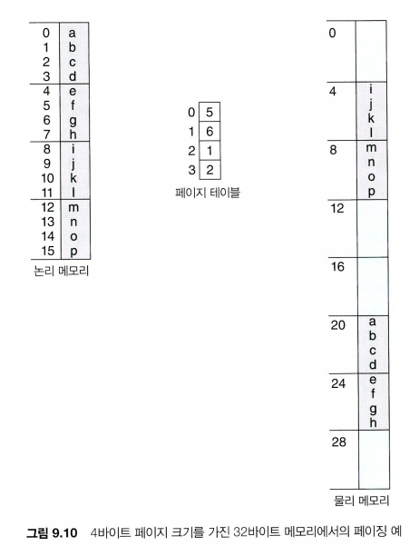

## main memory
### static linking VS. dynamic linking
- static linking: 정적 링킹. 컴파일 링킹 때 라이브러리를 그대로 복사해서 실행 파일에 이진 형식으로 넣음.

	-> 메모리를 많이 잡아먹음.

 - dynamic linking: 동적 링킹. 프로그램이 실행될 때, 라이브러리가 필요하다면 라이브러리를 가져와서 링킹. 한 번 링킹이 되어 있다면 가져왔던 라이브러리를 그대로 사용.

	-> 메모리 요구사항이 적음. jump를 하기 때문에 overhead 발생.

	-> 라이브러리의 버전업이 되었을 때 편리. 그대로 가져와서 사용하면 됨.

### 주소 할당
1. 컴파일 시간(compile time)
절대 코드 생성. 위치 변경이 필요하면 다시 컴파일해야 함.

2. 적재 시간(load time)
프로세스를 메모리에 로딩 시 통째로 적재.

3. 실행 시간(execution time)
프로세스 실행 중 코드가 실행될 때마다 코드를 로딩.

### 연속 메모리 할당 - external fragmentation 발생, 50% rule
1. first-fit
2. best-fit
3. worst-fit

### 페이징(고정 분할) - internal fragmentation 발생

#### 1.
#### 2.
#### 3.